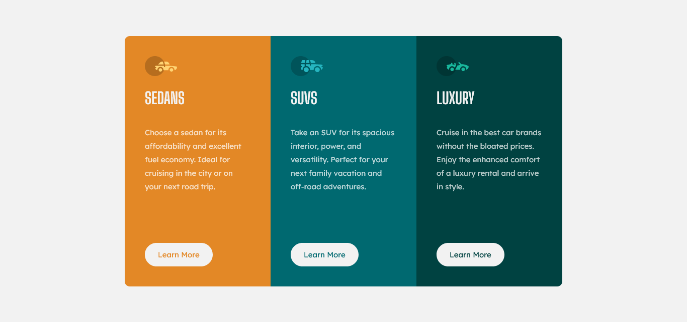

# Frontend Mentor - 3-column preview card component

Esta es una solucion al desafio [3-column preview card component en Frontend Mentor](https://www.frontendmentor.io/challenges/3column-preview-card-component-pH92eAR2-).

## Overview

### Screenshot

### 🚀 Demo

- [3-column preview card component](https://kaelldrick.github.io/3-column-preview-card-component/)

### 💻 Built with

- HTML5
- CSS
- REACT

### Dependencies

**Animate.css**: Es una biblioteca de animaciones listas para usar. [animate.css](https://animate.style/)

## Author

- Frontend Mentor - [@Kaelldrick](https://www.frontendmentor.io/profile/Kaelldrick)

